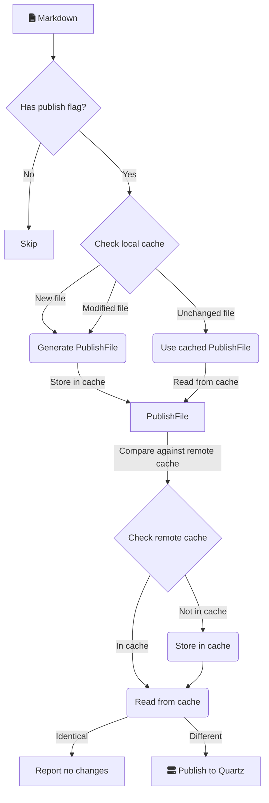

> [!WARNING] Upcoming feature
>
> This feature is expected to be released with version `1.8.0`

```mermaid
flowchart TD
    A[fa:fa-file-text Markdown] --> B{Has publish flag?}
    B --> |No| Z[Skip]
    B --> |Yes| C{Check local cache}
    C --> |New file| D(Generate PublishFile)
    C --> |Modified file| D
    D --> |Store in cache| E[PublishFile]
    C --> |Unchanged file| F(Use cached PublishFile)
    F --> |Read from cache| E
    E --> |Compare against remote cache| G{Check remote cache}
    G --> |Not in cache| H(Store in cache)
    G --> |In cache| J(Read from cache)
    J --> |Identical| I[Report no changes]
    H --> J
    J --> |Different| K[fa:fa-server Publish to Quartz]
```
