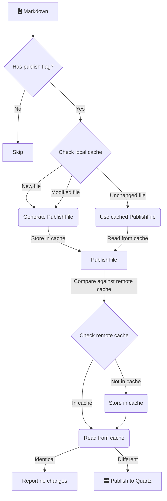

When enabled, Quartz Syncer caches compiled files to avoid reprocessing unchanged notes.

## How it works

## Dynamic content handling

Files containing [[Dataview]] or [[Datacore]] queries are automatically detected and flagged as containing dynamic content. These files are always recompiled when you open the Publication Center, ensuring query results reflect the current state of your vault.

After recompilation, the output is compared against the published version. If the compiled result is identical, the file won't appear as changed—only files with actual differences are shown.
