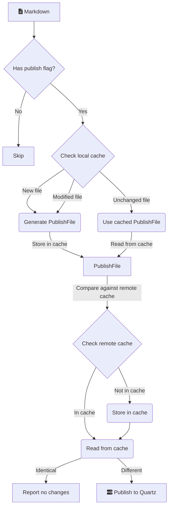

When enabled, Quartz Syncer caches compiled files to avoid reprocessing unchanged notes.

## How it works

```mermaid
flowchart TD
    A[fa:fa-file-text Markdown] --> B{Has publish flag?}
    B --> |No| Z[Skip]
    B --> |Yes| C{Check local cache}
    C --> |New file| D(Generate PublishFile)
    C --> |Modified file| D
    D --> |Store in cache| E[PublishFile]
    C --> |Unchanged file| F(Use cached PublishFile)
    F --> |Read from cache| E
    E --> |Compare against remote cache| G{Check remote cache}
    G --> |Not in cache| H(Store in cache)
    G --> |In cache| J(Read from cache)
    J --> |Identical| I[Report no changes]
    H --> J
    J --> |Different| K[fa:fa-server Publish to Quartz]
```

## Background pre-compilation

When caching is enabled, Quartz Syncer compiles your notes in the background as you edit. This means:

- **Startup**: all publishable notes are queued for compilation at low priority after a 10-second delay.
- **Vault changes**: when you modify, create, or rename a file, it's queued for recompilation at medium priority.
- **Active file**: the file you're currently editing is skipped to avoid interfering with your work. It's compiled when you navigate to a different file.
- **Publication Center**: opens near-instantly because all notes are already compiled and cached.

The status bar shows "Quartz Syncer: N compiling" while background compilation is in progress, and "Quartz Syncer: ready" when all files are compiled.

## Dynamic content handling

Files containing [[Dataview]] or [[Datacore]] queries are automatically detected and flagged as containing dynamic content.

Quartz Syncer tracks revision numbers from the Dataview and Datacore plugin APIs. When a revision changes (meaning query results may have changed), only the affected files are recompiled in the background. This means dynamic content is kept up-to-date without recompiling every file on every vault change.

If the Dataview or Datacore APIs are not available (plugins not installed), all dynamic files are recompiled whenever any file in the vault changes.
